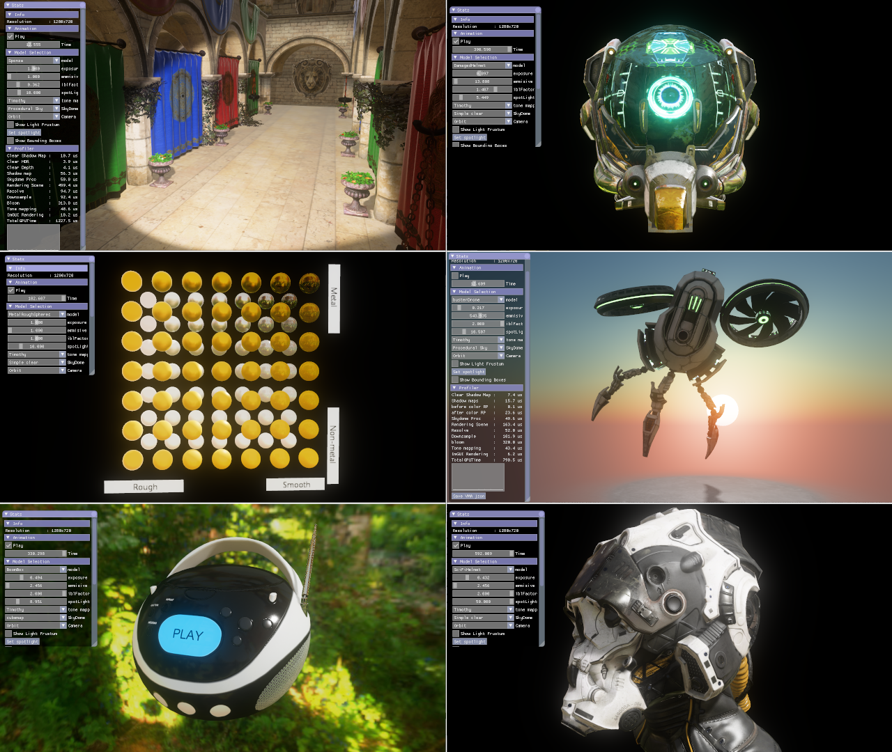

# glTFSample 

A simple but cute demo to show off the capabilities of the [Cauldron framework](https://github.com/GPUOpen-LibrariesAndSDKs/Cauldron).



# Build Instructions

### Prerequisites

To build glTFSample, you must first install the following tools:

- [CMake 3.4](https://cmake.org/download/)
- [Visual Studio 2017](https://visualstudio.microsoft.com/downloads/)
- [Windows 10 SDK 10.0.17763.0](https://developer.microsoft.com/en-us/windows/downloads/windows-10-sdk)
- [Vulkan SDK 1.1.106](https://www.lunarg.com/vulkan-sdk/)

Then follow the next steps:

1) Get the media files:
    ```
    > git clone https://github.com/GPUOpen-LibrariesAndSDKs/Cauldron-Media.git
    ```

2) Clone the repo with its submodules:
    ```
    > git clone https://github.com/GPUOpen-LibrariesAndSDKs/glTFSample.git --recurse-submodules
    ```

3) Generate the solutions:
    ```
    > cd glTFSample\build
    > GenerateSolutions.bat
    ```

4) Open the solutions in the VK or DX12 directories, compile and run.

